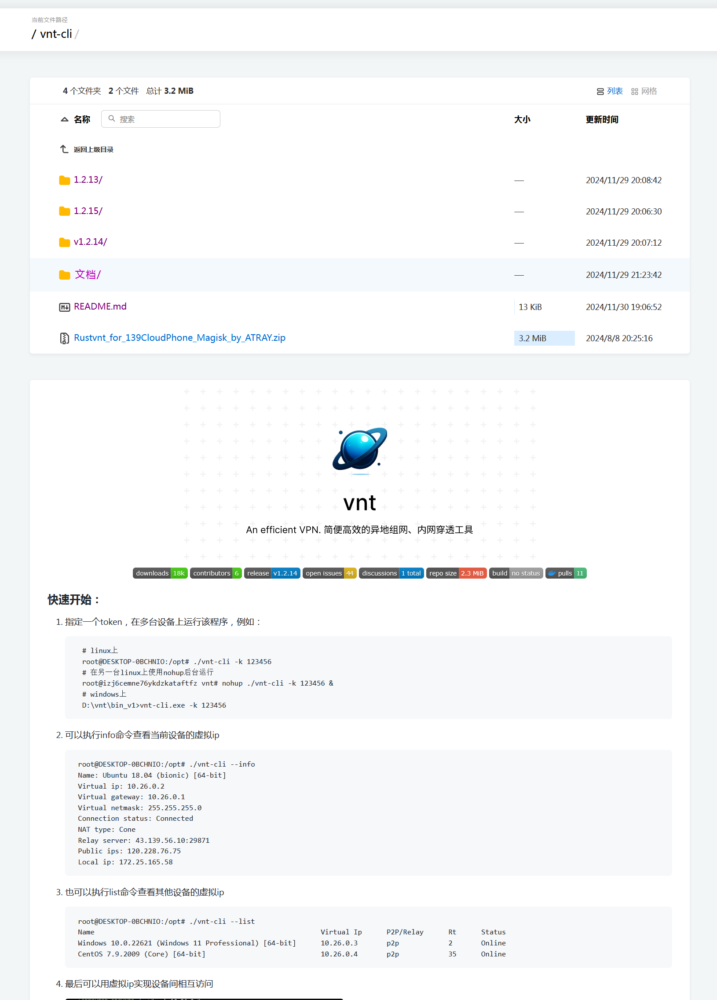
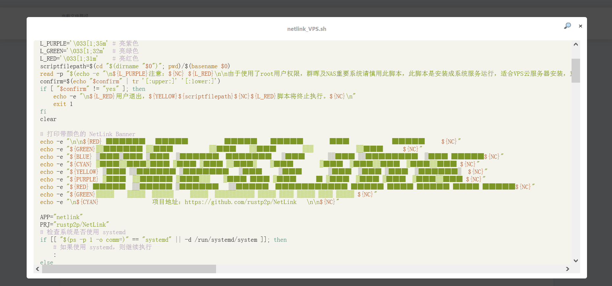
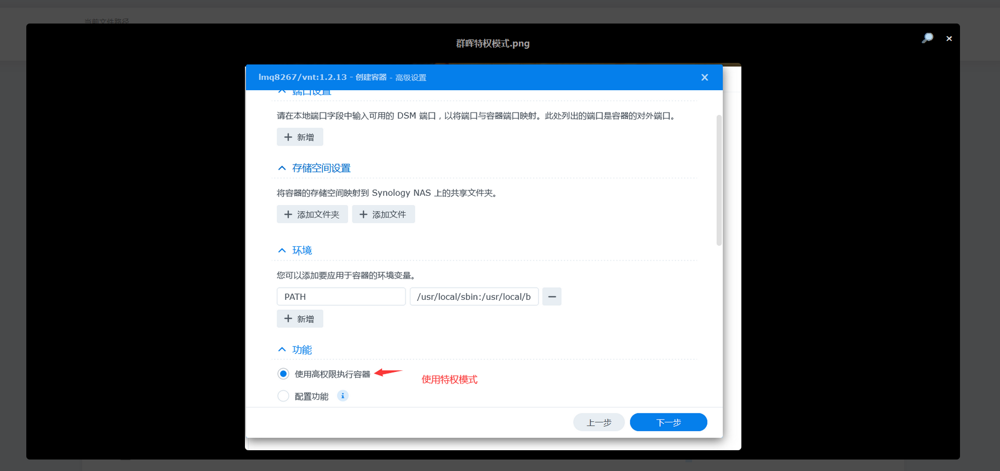

# 项目地址：[caddyserver/caddy](https://github.com/caddyserver/caddy)
<p align="center">
 
 <a href="https://deepwiki.com/lmq8267/caddy"></a>
<a href="https://github.com/lmq8267/caddy/releases"></a>
<a href="https://github.com/lmq8267/caddy/graphs/contributors"></a>
<a href="https://github.com/lmq8267/caddy/releases/"></a>
<a href="https://github.com/lmq8267/caddy/issues"></a>
<a href="https://github.com/lmq8267/caddy/discussions"></a>
<a href="GitHub repo size"></a>
<a href="https://github.com/lmq8267/caddy/actions?query=workflow%3ABuild"></a>
</p>

caddy的大概[命令参数](https://github.com/lmq8267/caddy/blob/main/README_caddy.md)  
文件服务器的[UI预览效果图](https://github.com/lmq8267/caddy?tab=readme-ov-file#ui%E9%A2%84%E8%A7%88)

------------------------------------------------------------------------------

### 添加了两个插件：

1. [mholt/caddy-webdav](https://github.com/mholt/caddy-webdav)
 
2. [aksdb/caddy-cgi](https://github.com/aksdb/caddy-cgi)

------------------------------------------------------------------------------

### 启动方法参照：hiboy的[Sh87_cad_dy.sh](https://github.com/hiboyhiboy/opt-script/blob/0dcfdf2911f052218ffb1b7cd220f1457249f538/script/Sh87_cad_dy.sh#L151C28-L151C78)

```shell
/tmp/caddy run --config /tmp/Caddyfile --adapter caddyfile
```

------------------------------------------------------------------------------

### Caddyfile 配置文件内容如下：

```shell
{ # 全局配置
order cgi before respond # 启动 cgi 模块 # 全局配置
order webdav before file_server # 启动 webdav 模块 # 全局配置
admin off # 关闭 API 端口 # 全局配置
} # 全局配置

:8889 {
 #文件服务器，后面是文件路径；效果类似于https://opt.cn2qq.com 
 root * /mnt/sda1/filebrowser/caddy
 file_server browse
        
 log {
  output file /tmp/caddy/requests.log {
   roll_size     1MiB
   roll_local_time
   roll_keep     5
   roll_keep_for 120h
  }
 }
}

 :12322 {
  webdav * {
   root /mnt/sda1/caddy/www
  }
 }
```

 ------------------------------------------------------------------------------
 
 另外的功能 我没用过
```shell
 #认证，账号admin 密码123456
  basicauth /dav/* {
   admin $2a$14$RdbOHzJhf5BaapSdlYTCbe.yWY9cEZjyDpfgwStY28K/qsM1tX8tu
  }
  #webdav
  webdav /dav/* {
   prefix /dav
   root /
  }
  
#ssl证书就是
tls {
  protocols tls1.2 tls1.3
 } 
```

-----------------------------------------------------------------------------

#basicauth的密码生成是直接用caddy命令：
```shell
/tmp/caddy hash-password  --plaintext 123456
```

----------------------------------------------------------------------------

### UI预览 

[在线预览](http://s1.ct8.pl:1095/caddy/)

###### 1.全中文界面 支持文件夹内`README.md`预览



###### 2.支持脚本文件预览



###### 3.照片、视频、音频 的预览和播放




